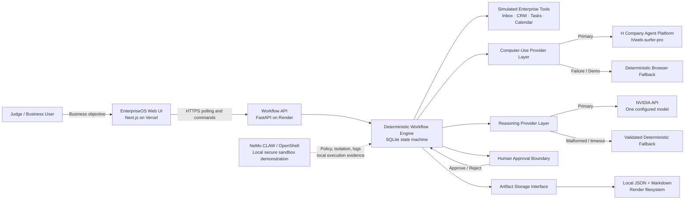
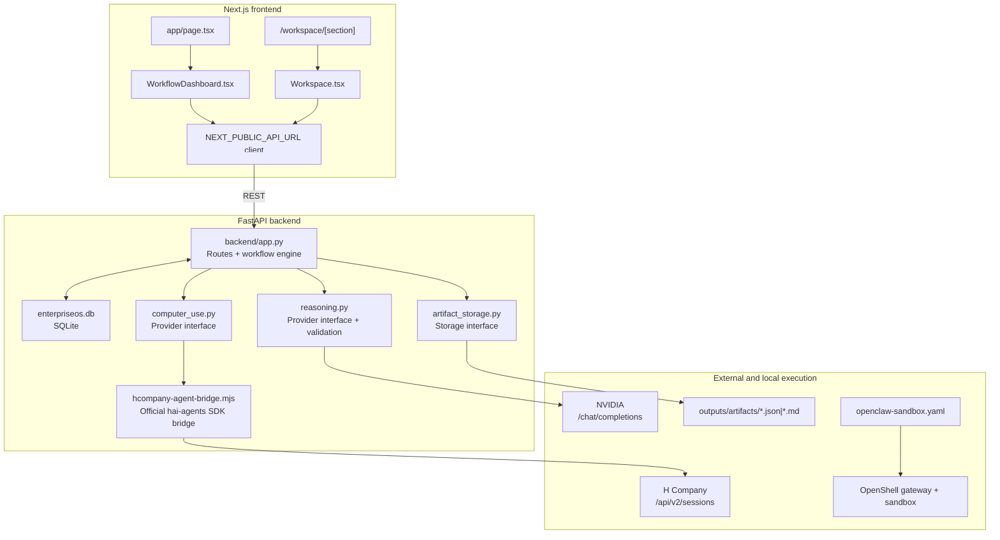
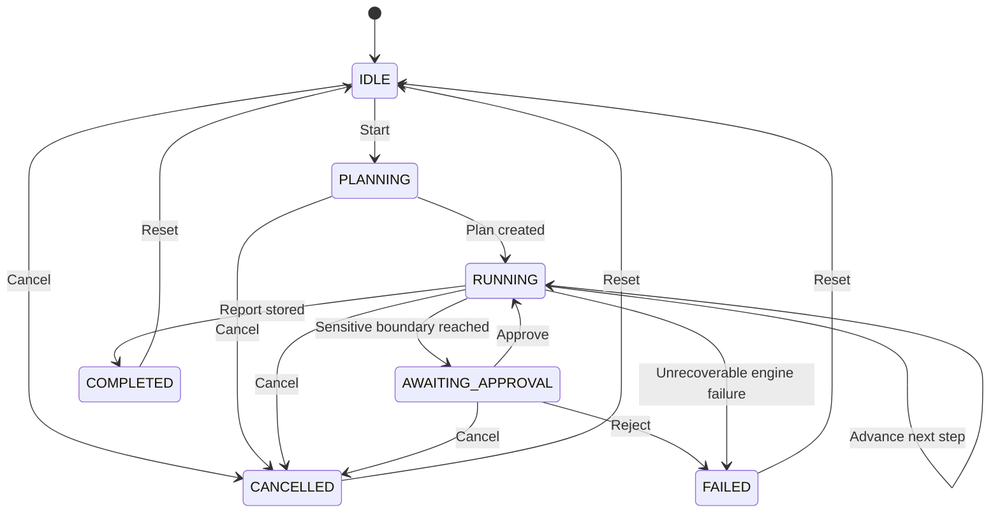
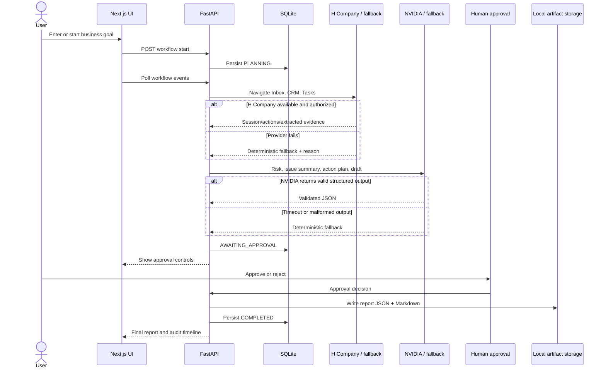
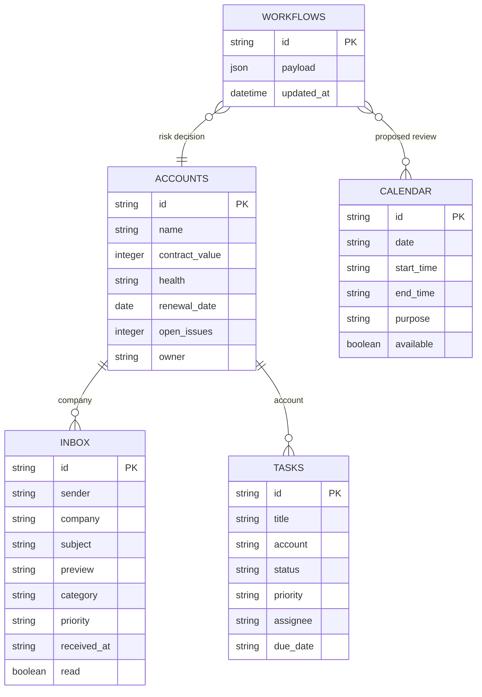
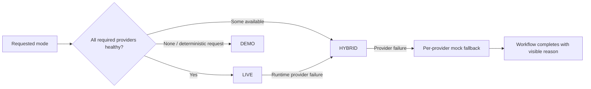
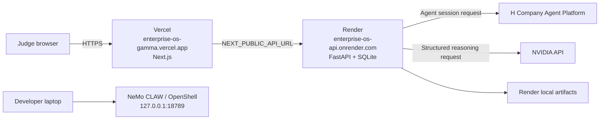
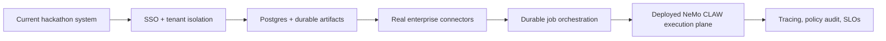

# EnterpriseOS — Architecture, Product, and Judge Demo Guide

EnterpriseOS is an AI employee that turns a business objective into a governed, auditable workflow across simulated enterprise applications. It combines computer-use automation, structured AI reasoning, human approval, and artifact generation to resolve high-value customer risks without requiring access to real production systems. The hackathon demo focuses on one reliable outcome: identifying the highest-risk customer, connecting their feedback to commercial and engineering evidence, preparing a response and action plan, pausing for approval, and producing an executive report.

## 1. Executive summary

Enterprise teams lose time because customer signals, contract context, engineering work, and leadership decisions live in disconnected applications. A customer escalation may arrive in an inbox, while renewal value lives in CRM, root-cause work lives in a task tracker, meeting availability lives in a calendar, and the final decision exists only in a leader's head. EnterpriseOS converts one natural-language goal into a traceable workflow that collects this evidence, reasons over it, stops before a sensitive action, and produces a decision-ready artifact.

The public application is available at:

- Frontend: <https://enterprise-os-gamma.vercel.app>
- Backend: <https://enterprise-os-api.onrender.com>
- Backend health: <https://enterprise-os-api.onrender.com/health>
- Integration health: <https://enterprise-os-api.onrender.com/api/integrations/health>

## 2. Enterprise problem

### 2.1 Current operating problem

Customer-risk reviews are usually manual and fragmented:

1. A leader reads several inbox threads and tries to infer which account matters most.
2. Someone opens CRM to find contract value, health, renewal timing, and ownership.
3. Engineering tickets are searched manually and may not be linked consistently to the account.
4. The team writes an action plan and customer response from incomplete evidence.
5. A meeting may be scheduled before the right person approves the proposed response or action.
6. The final decision is difficult to audit because evidence and reasoning are spread across tools.

### 2.2 Business impact

- Slow response to escalations.
- Inconsistent risk prioritization.
- High-value renewals receive the same attention as low-impact complaints.
- Engineering work is disconnected from customer and revenue context.
- Sensitive actions can occur without a clear approval boundary.
- Executive reporting is manually assembled and quickly becomes stale.

### 2.3 EnterpriseOS outcome

For the demo, EnterpriseOS identifies **Acme Health** as the highest-risk, high-value account:

- Contract value: **$640,000**.
- Account health: **At risk**.
- Renewal risk: near-term renewal with declining confidence.
- Customer evidence: recurring payment timeouts and inaccurate claims exports.
- Engineering evidence: payment timeout, claims export, and customer-facing RCA work.
- Safety outcome: stop before meeting confirmation and request human approval.
- Final output: verified executive report stored as JSON and Markdown.

## 3. Product goal and scope

### 3.1 Judge goal

> Review recent customer feedback, identify the highest-risk high-value customer, inspect related engineering issues, prepare an action plan, draft a customer response, and schedule an internal review.

### 3.2 Included simulated applications

- Inbox
- CRM
- Task Tracker
- Calendar
- Executive Report

### 3.3 Deliberately excluded

- Real Gmail, Salesforce, Jira, Slack, or Google Calendar integrations.
- Authentication and multi-tenant access control.
- Background queues and distributed orchestration.
- Automatic email sending.
- Purchases, deletion, or other destructive actions.
- Automatic meeting confirmation without approval.
- AWS S3 in the current no-credit deployment.

## 4. System architecture — HLD



### 4.1 HLD responsibility boundaries

| Layer | Responsibility | Deployment |
|---|---|---|
| Web UI | Goal, timeline, preview, approval, report | Vercel |
| FastAPI | API contract, workflow transitions, integration orchestration | Render |
| SQLite | Demo data and refresh-safe workflow state | Render local filesystem |
| H Company provider | Hosted computer-use session lifecycle | H Company Agent Platform |
| NVIDIA provider | Structured risk, planning, drafting, and verification | NVIDIA API |
| Mock providers | Guaranteed deterministic fallback | Render process |
| Artifact storage | JSON and Markdown report persistence | Render local filesystem |
| NeMo CLAW/OpenShell | Local sandbox, policy, gateway, logs | Developer machine |

## 5. System architecture — LLD



### 5.1 Backend modules

#### `backend/app.py`

- Initializes realistic seed data.
- Exposes stable API routes.
- Creates and stores the workflow.
- Advances one deterministic step per poll.
- Enforces approval and cancellation transitions.
- Invokes reasoning and artifact providers.
- Exposes integration health and computer-use demo routes.

#### `backend/computer_use.py`

Provider interface:

- `plan_action`
- `execute_browser_goal`
- `get_status`
- `cancel_execution`
- `health_check`

Implementations:

- `HCompanyComputerUseProvider`
- `MockComputerUseProvider`
- `FallbackComputerUseProvider`

Controls:

- Allowed-domain validation.
- Maximum action count.
- Timeout.
- Sensitive-action blocking.
- Explicit stop before confirming a meeting.
- Automatic fallback with visible reason.

#### `scripts/hcompany-agent-bridge.mjs`

- Uses the official `hai-agents` SDK.
- Reads credentials from environment variables, never command-line arguments.
- Starts `h/web-surfer-pro` sessions.
- Reads status, changes, answers, and Agent View URL.
- Cancels sessions.
- Checks account quota.

#### `backend/reasoning.py`

Provider interface:

- `analyze_customer_risk`
- `summarize_engineering_issues`
- `generate_action_plan`
- `draft_customer_response`
- `verify_workflow_result`

Controls:

- Strict JSON validation.
- Exactly one malformed-output repair attempt.
- Deterministic fallback after timeout or failed repair.
- No workflow crash from provider failure.

#### `backend/artifact_storage.py`

- Local filesystem implementation.
- Optional S3 implementation retained but disabled.
- Writes final report as JSON and Markdown.
- Falls back to Local without failing the workflow.

## 6. Workflow state machine



### 6.1 Step schema

Every workflow step contains:

```text
id
title
description
status
application
riskLevel
requiresApproval
startedAt
completedAt
output
error
```

### 6.2 Executive Customer Review steps

1. Open Inbox.
2. Review escalation emails.
3. Identify the affected customer.
4. Open CRM.
5. Inspect account value and health.
6. Open Task Tracker.
7. Find related engineering issues.
8. Generate recommended actions.
9. Draft a customer response.
10. Request human approval.
11. Open Calendar.
12. Prepare a review meeting.
13. Generate an executive report.

## 7. End-to-end sequence



## 8. Data model



## 9. API surface

### Core data

| Method | Route | Purpose |
|---|---|---|
| GET | `/health` | Backend availability |
| GET | `/api/demo/state` | All seeded demo data |
| POST | `/api/demo/reset` | Restore original demo state |
| GET | `/api/inbox` | Inbox records |
| GET | `/api/accounts` | CRM accounts |
| GET | `/api/tasks` | Task records |
| GET | `/api/calendar` | Available calendar records |

### Workflow

| Method | Route | Purpose |
|---|---|---|
| POST | `/api/workflows/demo` | Create/reset demo workflow |
| GET | `/api/workflows/{id}` | Read refresh-safe workflow state |
| POST | `/api/workflows/{id}/start` | Begin execution |
| POST | `/api/workflows/{id}/approve` | Approve sensitive boundary |
| POST | `/api/workflows/{id}/reject` | Reject sensitive action |
| POST | `/api/workflows/{id}/cancel` | Cancel workflow |
| GET | `/api/workflows/{id}/events` | Poll and advance execution |

### Integrations

| Method | Route | Purpose |
|---|---|---|
| GET | `/api/integrations/health` | Actual configured provider modes |
| GET | `/api/computer-use/health` | Computer-use configuration status |
| POST | `/api/computer-use/demo` | Start controlled computer-use scenario |

## 10. Sponsor and platform usage

### 10.1 H Company — computer use

Intended role:

- Open the public EnterpriseOS Inbox.
- Select the Acme Health escalation.
- Extract customer and issue.
- Navigate to CRM and inspect value and health.
- Navigate to Task Tracker and identify linked issues.
- Navigate to Calendar.
- Stop before meeting confirmation.

Safety envelope:

- Public EnterpriseOS domain only.
- No email sending.
- No purchases.
- No deletion.
- No meeting confirmation without approval.
- Maximum action count and timeout.
- Deterministic visual fallback.

Current public status as of **July 12, 2026**:

- Credentials are configured.
- The provider layer and official SDK bridge are deployed.
- A public session attempt returned an H Company `403` explicit authorization deny.
- EnterpriseOS correctly switched to `Mock` and displayed the fallback reason.
- Do not claim public H Company navigation is live until a session starts with `providerMode: Connected`.

### 10.2 NVIDIA — structured reasoning

Role:

- Analyze customer risk.
- Summarize engineering issues.
- Generate action plan.
- Draft customer response.
- Verify final result.

Current public status:

- NVIDIA is configured and has produced valid live structured output.
- The completed public workflow also recorded intermittent fallback events.
- Recommended Render setting: `NVIDIA_TIMEOUT_SECONDS=60`.
- The dashboard must retain visible fallback status rather than claiming every response was live.

### 10.3 NeMo CLAW / OpenShell — secure execution

Role demonstrated locally:

- Isolated agent execution environment.
- Explicit filesystem and network policy.
- Gateway and sandbox status.
- Effective policy inspection.
- Auditable logs.

Current status:

- OpenShell `0.0.72` is installed.
- OpenClaw `2026.3.24` is installed.
- The `nemoclaw` gateway and sandbox processes are running locally.
- Dashboard: <http://127.0.0.1:18789>
- Policy: `openclaw-sandbox.yaml`.
- The Render process is not currently hosted inside the local NeMo CLAW sandbox.

Accurate judge wording:

> NeMo CLAW/OpenShell provides our secure local execution and policy demonstration, including isolation, effective-policy inspection, and audit logs. The public FastAPI demonstration is hosted separately on Render.

### 10.4 Artifact storage

- AWS is intentionally not used because no credits are available.
- Reports are stored locally as JSON and Markdown.
- The provider interface retains S3 support for a later connected deployment.
- Render local files are ephemeral and should not be described as durable production storage.

## 11. Execution modes

| Mode | Behavior |
|---|---|
| LIVE | H Company, NVIDIA, and S3 connected. Not used currently. |
| HYBRID | Use available real providers; visibly fall back when unavailable. Current public mode. |
| DEMO | Fully deterministic, credential-free, guaranteed completion. Backup mode. |

Automatic downgrade principle:



## 12. Security and governance

### 12.1 Human-in-the-loop

- Scheduling is treated as a sensitive boundary.
- Workflow pauses in `AWAITING_APPROVAL`.
- Approval continues execution.
- Rejection marks the sensitive step failed and prevents scheduling.
- Cancellation is available before completion.

### 12.2 Provider isolation

- Providers implement stable interfaces.
- External failures cannot corrupt the workflow state.
- Malformed NVIDIA output is validated and repaired once.
- H Company navigation is restricted to an allowlist.
- Provider mode and fallback reason are visible to the user.

### 12.3 Secret handling

- `.env` is ignored by Git.
- `.env.example` contains placeholders only.
- H Company and NVIDIA keys live only on the backend host.
- No secret uses the `NEXT_PUBLIC_` prefix.
- Previously exposed keys must be rotated.

### 12.4 Demo limitations

- SQLite and local artifacts on Render are ephemeral.
- Free Render instances may cold-start after inactivity.
- The simulated enterprise tools do not represent production authorization boundaries.
- The current public H Company session is blocked by vendor authorization.
- NeMo CLAW runs locally rather than inside Render.

## 13. Deployment topology



### 13.1 Production environment variables

Frontend on Vercel:

```env
NEXT_PUBLIC_API_URL=https://enterprise-os-api.onrender.com
```

Backend on Render:

```env
ENTERPRISEOS_MODE=HYBRID

HAI_API_KEY=<rotated-secret>
HCOMPANY_API_KEY=<same-rotated-secret>
HCOMPANY_BASE_URL=https://agp.hcompany.ai
HCOMPANY_MODEL=h/web-surfer-pro
HCOMPANY_TIMEOUT_SECONDS=30
HCOMPANY_MOCK_MODE=false
HCOMPANY_MAX_ACTIONS=12

NVIDIA_API_KEY=<secret>
NVIDIA_BASE_URL=https://integrate.api.nvidia.com/v1
NVIDIA_MODEL=meta/llama-3.1-70b-instruct
NVIDIA_TIMEOUT_SECONDS=60
NVIDIA_MOCK_MODE=false

AWS_USE_LOCAL_MODE=true
ENTERPRISEOS_PUBLIC_URL=https://enterprise-os-gamma.vercel.app
ENTERPRISEOS_DEMO_DOMAIN=enterprise-os-gamma.vercel.app
```

## 14. Required demo preparation

### 14.1 Five-minute pre-demo checklist

1. Open the Vercel application and verify the dashboard loads.
2. Open Render `/health` once to wake the free instance.
3. Open Render `/api/integrations/health` and note honest modes.
4. Reset the EnterpriseOS demo.
5. Open the NeMo CLAW dashboard at `http://127.0.0.1:18789`.
6. Run `openshell status -g nemoclaw`.
7. Run `openshell sandbox list -g nemoclaw` and record the sandbox name.
8. Keep `openclaw-sandbox.yaml` open in an editor.
9. Keep a deterministic backup run ready.
10. Never display API keys or `.env`.

### 14.2 NeMo CLAW commands

```bash
openshell --version
openclaw --version
openshell status -g nemoclaw
openshell sandbox list -g nemoclaw
openshell sandbox get <sandbox-name> -g nemoclaw
openshell policy get <sandbox-name> -g nemoclaw
openshell logs <sandbox-name> -g nemoclaw --since 5m
```

## 15. Two-minute judge script

### 0:00–0:15 — The problem

> Customer risk is scattered across communications, CRM, engineering tools, and calendars. Enterprise leaders spend hours assembling context and can still act without complete evidence. EnterpriseOS turns one business goal into a governed, auditable workflow.

### 0:15–0:30 — Enter the objective

Show the goal:

> Review recent customer feedback, identify the highest-risk high-value customer, inspect related engineering issues, prepare an action plan, draft a customer response, and schedule an internal review.

Click **Reset Demo**, then **Start Demo**.

### 0:30–0:55 — Computer-use evidence

Show the application preview moving through:

- Inbox: Acme Health escalation.
- CRM: $640,000 contract and at-risk health.
- Task Tracker: payment timeout, claims export, and RCA.

Say:

> The H Company provider is isolated behind a stable computer-use interface. If the provider is unavailable or unauthorized, EnterpriseOS visibly uses the deterministic browser fallback rather than breaking or falsely claiming a live connection.

### 0:55–1:15 — NVIDIA reasoning

Show:

- Risk score.
- Risk explanation.
- Engineering summary.
- Action plan.
- Customer response draft.

Say:

> NVIDIA produces structured, validated reasoning. Malformed output receives one repair attempt, and any remaining failure falls back deterministically with the reason preserved in the audit record.

### 1:15–1:30 — Human approval

Show the workflow paused in `AWAITING_APPROVAL`.

> EnterpriseOS can inspect and recommend autonomously, but it cannot confirm the meeting until a person approves the sensitive action.

Click **Approve**.

### 1:30–1:45 — Report and audit trail

Show:

- Customer at risk.
- Contract value.
- Related engineering issues.
- Recommended actions.
- Draft response.
- Proposed agenda.
- Verification score.
- Artifact location.

### 1:45–2:00 — NeMo CLAW security

Switch to the local NeMo CLAW/OpenShell dashboard and terminal.

> Our secure local execution demonstration runs under NeMo CLAW/OpenShell. The gateway exposes the active sandbox, effective policy, and audit logs so we can prove what the agent is allowed to access rather than relying on a prompt alone.

## 16. Backup demo

If an external provider fails:

1. Keep the application in Hybrid or Demo mode.
2. Reset the workflow.
3. Run the deterministic workflow.
4. Point to the visible `Mock` badge and fallback reason.
5. Complete approval and show the report.
6. Explain that guaranteed completion is a deliberate reliability feature, not a hidden substitution.

If Render is cold:

1. Open `/health`.
2. Wait for the free instance to wake.
3. Refresh the frontend.

If the public frontend is unavailable:

```bash
./scripts/start.sh
```

Then open `http://localhost:3000`.

## 17. Validation plan

### 17.1 Functional

- All workspace routes return HTTP 200.
- Reset restores seed data.
- Workflow starts from IDLE.
- Steps execute in order.
- Approval pauses execution.
- Rejection blocks scheduling.
- Approval completes execution.
- Final report appears.
- JSON and Markdown artifacts exist.

### 17.2 Provider

- H Company missing key.
- H Company timeout.
- Invalid H Company response.
- Navigation outside allowed domain.
- Maximum action limit.
- Sensitive action blocking.
- H Company mock fallback.
- NVIDIA valid structured response.
- NVIDIA malformed response and repair.
- NVIDIA timeout fallback.
- Local artifact storage.
- S3 absence and failure fallback.

### 17.3 Deployment

- Vercel frontend HTTP 200.
- Render `/health` HTTP 200.
- CORS allows `https://enterprise-os-gamma.vercel.app`.
- `NEXT_PUBLIC_API_URL` points to Render.
- No secret appears in Git history or browser variables.
- Production build succeeds.

## 18. Judge questions and answers

### Is H Company genuinely integrated?

Yes, the backend uses the official `hai-agents` SDK through an isolated bridge and supports session start, status, changes, and cancellation. The current public session attempt is being denied by H Company's authorization policy, so the public demo honestly falls back and does not claim `Connected`.

### Why use NVIDIA instead of hard-coded rules?

NVIDIA converts mixed customer, commercial, and engineering evidence into structured risk analysis, action plans, drafts, and verification. Deterministic output remains as a reliability layer, not as the intended source of every live reasoning result.

### What does NeMo CLAW add?

It demonstrates a security boundary outside the model prompt: sandbox isolation, explicit policy, gateway status, effective-policy inspection, and logs. The current public Render runtime is separate, which is disclosed clearly.

### Why is human approval required?

Reading and reasoning are reversible. Confirming a meeting or communicating externally affects people and calendars, so EnterpriseOS pauses before that boundary.

### What would change for production?

Use durable Postgres and object storage, enterprise authentication, tenant isolation, real application connectors, encrypted secret management, queues for long-running work, webhook-based provider updates, monitoring, and a deployed NeMo CLAW execution plane.

## 19. Production evolution



The hackathon system prioritizes a polished, honest, and recoverable demonstration. Its core architectural value is not the number of integrations; it is the combination of evidence gathering, structured reasoning, an explicit approval boundary, provider isolation, visible fallbacks, and a complete audit trail.
